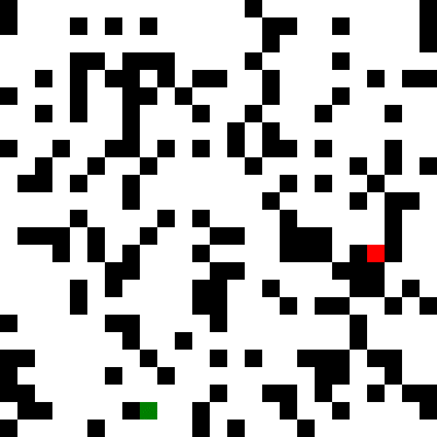
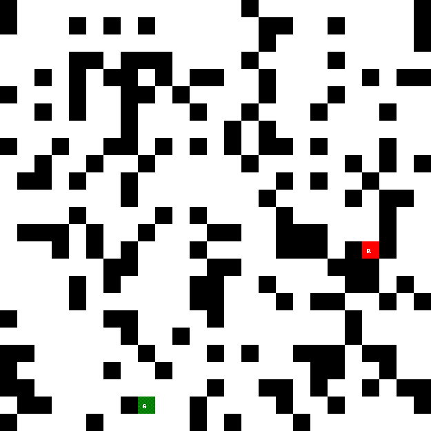

# grokking_ai
Playground repos while playing with the book "Grokking Artificial Algorithms"

## Search Algorithms

Search algorithms can be found in the `search` folder. Within, you'll find these files:

* `test.py` - will generate a random map and attempt to traverse it with each of the available algorithms. IF the map generated can't be solved, it'll error out.
- `searcher.py` - A generic `Searcher` class that sets up and manages basics a searcher would need. Expects children to implement a `step` function which expans the robot's consideration of a path by one "step" in its search algorithm.
- `grid.py` - a `Grid` class with internal functions that provide utility functions that include:
    - The ability to read and write grids to a text file with any CSV support (default is space delimited). This means a simple spreadsheet app can be used to easily generate maps.
    - The ability to draw the map out to an image
    - Controlled moving of a "robot" around the map, neighbor finding, obstacle awareness, goal awareness, etc.

    Within the `grid.py` file there is also a `GridGIFMaker` class which accepts a grid and can generate a gif of a given `Searcher` class. There is also a `grid_generator` that makes random `Grid` objects.
- `breadth_first_search.py` - implements a `BFS` breadth first search `Searcher`
- `depth_first_search.py` - implements a `DFS` depth first search `Searcher` 
- `a_star.py` - this implements an A* searcher that uses simple euclidean distance for its cost function.

### Search Examples

#### Breadth First Search

#### Depth First Search

#### A* Search
